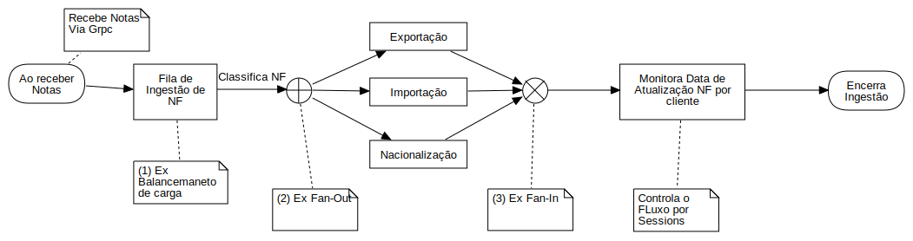
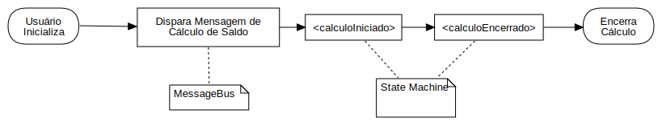
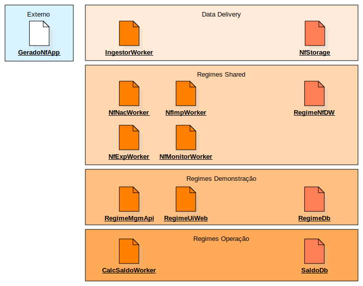

# Arquitetura

Esse projeto destina-se a criação de um fluxo de operação fictício para explorar diferentes padrões de processamentos assíncronos com uso de eventos e mensageiria.

## Fluxo de dados

O Fluxo desenhado a seguir demonstra a cadeia de eventos e a relação dos projetos entre si.

1. Teste de distribuição de carga de um mesmo subscription para vários workers;
2. Exemplo de Fan-Out;
3. Exemplo de Fan-In;
4. Exemplo de Gestão de Estado;

## Diagrama de Implantação

